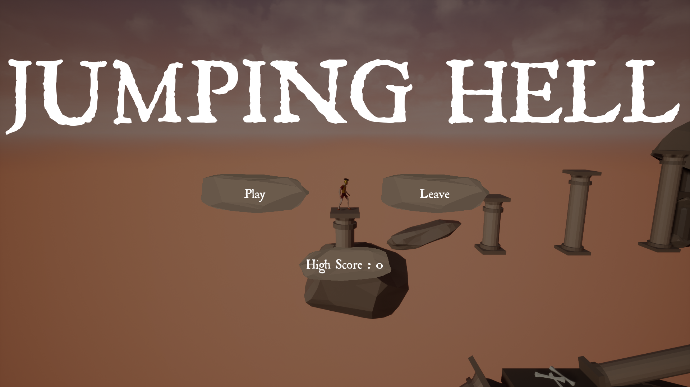
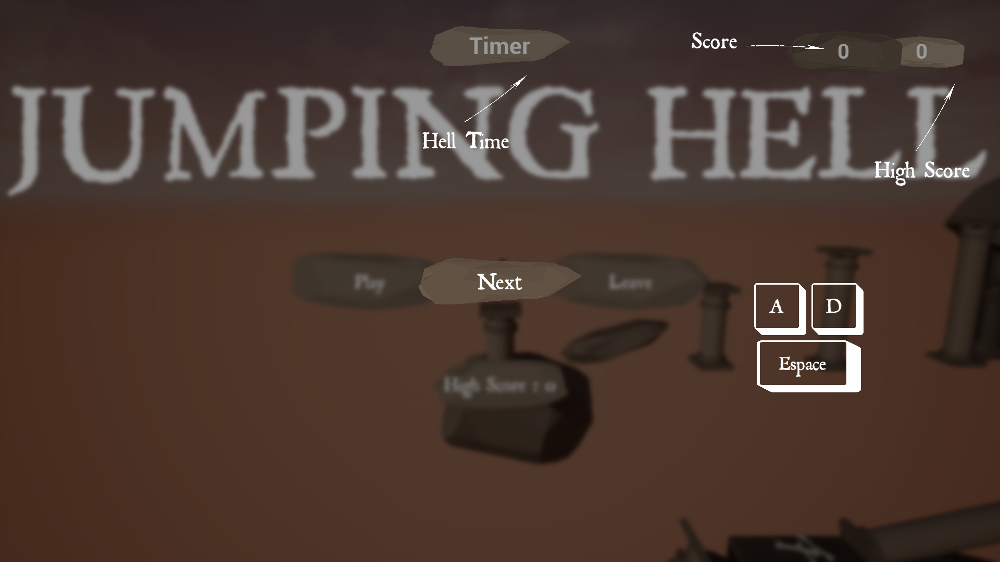
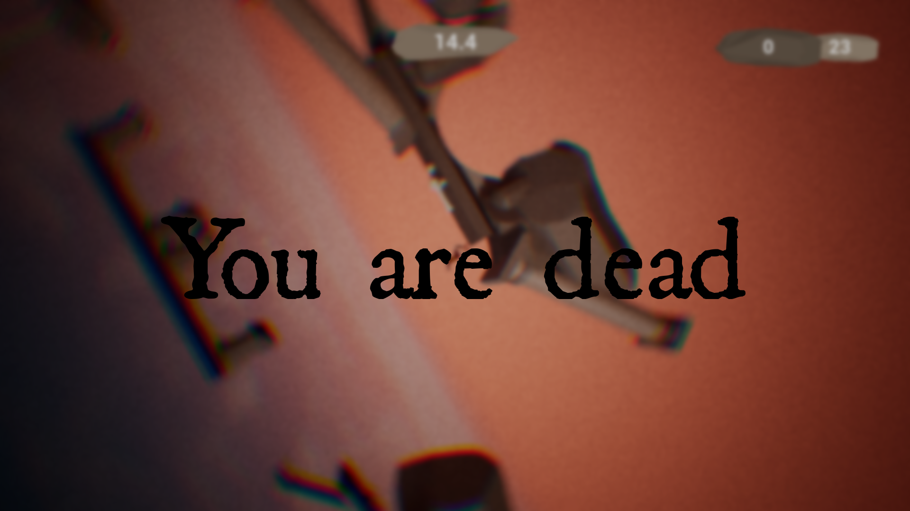
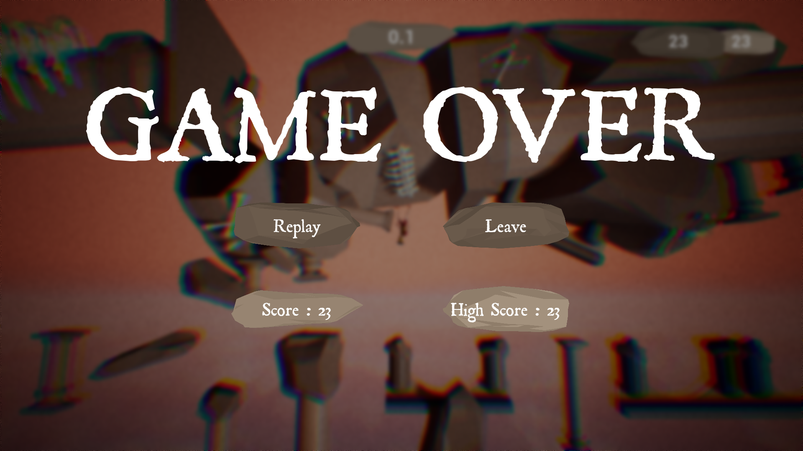
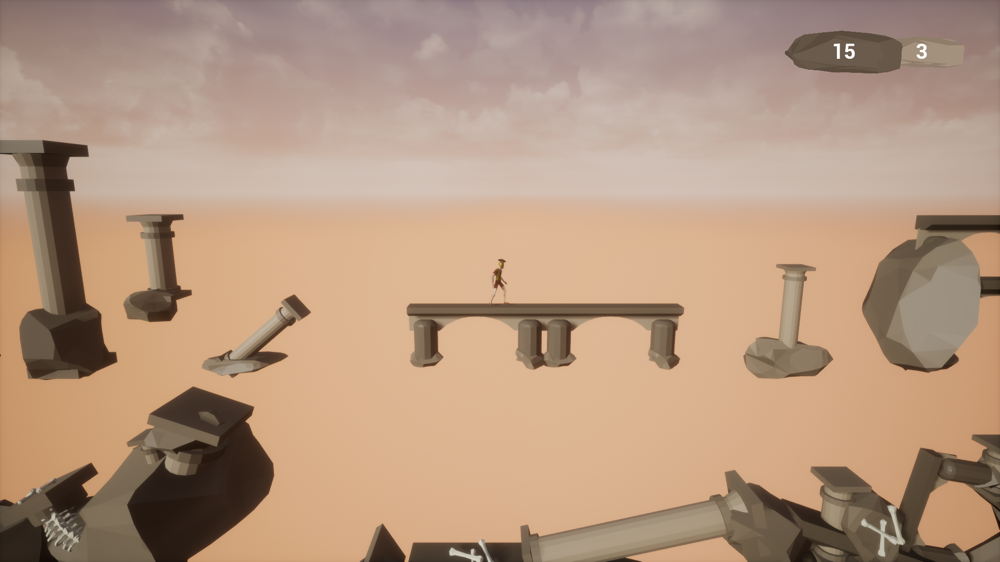
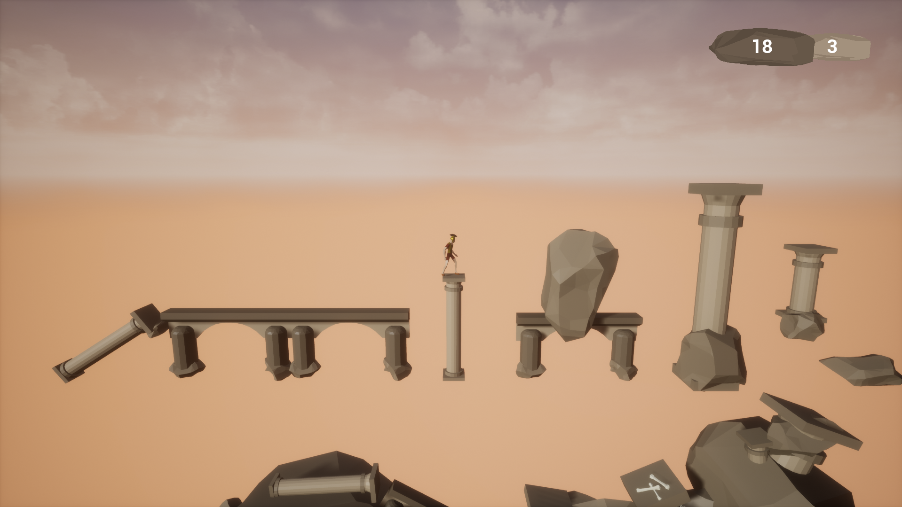
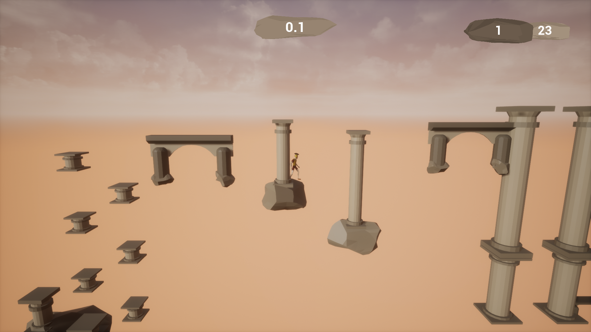

# Jumping Hell

In JumpingHell, jump from platform to platform. If you fall, you land in hell. You must then escape quickly and come back to life. Stay on course and try never to fall, or it's at your own risk...

## Contributors

[@untypequicode](https://github.com/untypequicode) : programing, UI, animations, music

[@bug](https://www.linkedin.com/in/elio-puyou/) : 3d modeling, level design, music

## Music

O Fortunae - Carmina Bunara, played on cello by us

## Pictures

  
   

   
  

  
   

  
   

  
   

  
   

  
   

