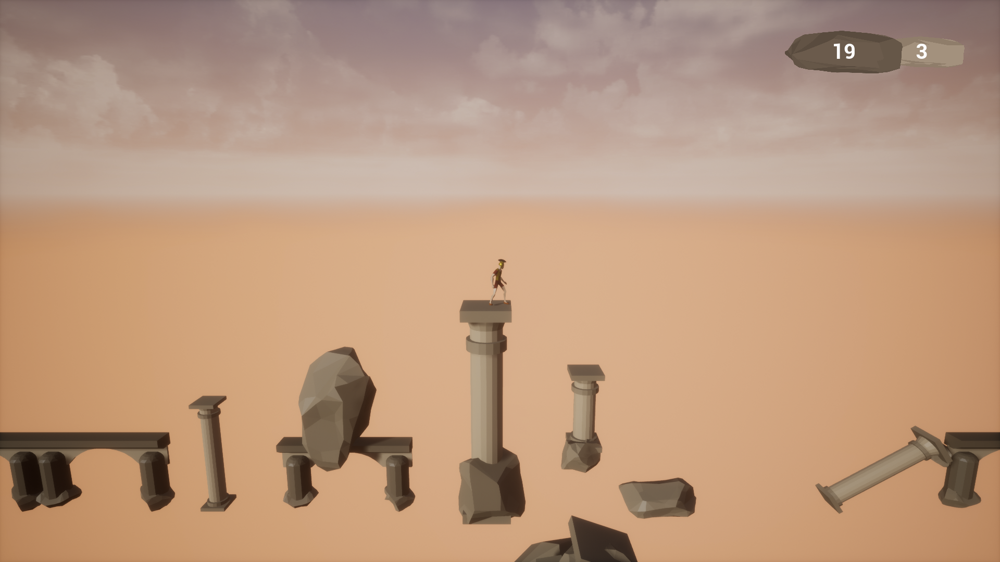

# Jumping Hell

In JumpingHell, you are jumping from platforms to platforms. If you fall down, you dead and you land to the hell. You need to escape quickly and come back to life.When you are into Hell, try to go back to the real world.

## Contributors

[@untypequicode](https://github.com/untypequicode) : programing, UI, animations, music

[@bug](#) : 3d modeling, level design, music

## Music

O Fortunae - Carmina Bunara, played on cello by us

## Pictures

  
   

  
   
  

  
   

